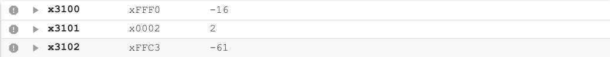
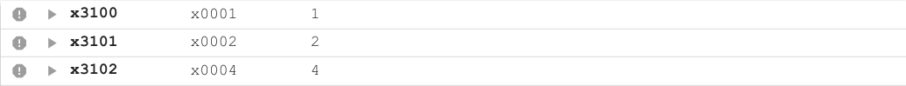

# Lab1

## Algorithm
1.  寄存待操作数的最高位即符号位，然后对待操作数左移一位（即自己加自己）,然后将最高位加到待操作数上，这样就成功循环移动了一次，通过计数器计数，来重复操作n次，就得到了想要的结果

## How to write?

1.  将内存起始地址x3100通过LEA以及PC offset赋给R7。程序开始于x3000，到LEA指令时，PC=x3001,加上x00ff即0000 0000 1111 1111得到x3100，因此偏移量为01111 1111
2.  通过LDR以及R7访问内存x3100和x3101，并赋给R1， R2， R1为待操作数，R2为旋转位数
3.  清空R4，R4作为最高位的寄存器，如果R1最高位为1，则R4 = 1，否则为初始值0，在R1进行左移操作（R1+R1）,之后加上R4的值，就将最高位移到了R1的最低位
4.  R2 -= 1
5.  通过BR指令判断R2是否为正数，若为正数，重新跳回R4=0的位置，进行下一次移位操作，否则停止，halt

## Test cases

1.  正数，负数分别测试即可

xFFF0向左循环移两位得到xFFC3结果正确

x0001向左循环移两位得到x0004结果正确

