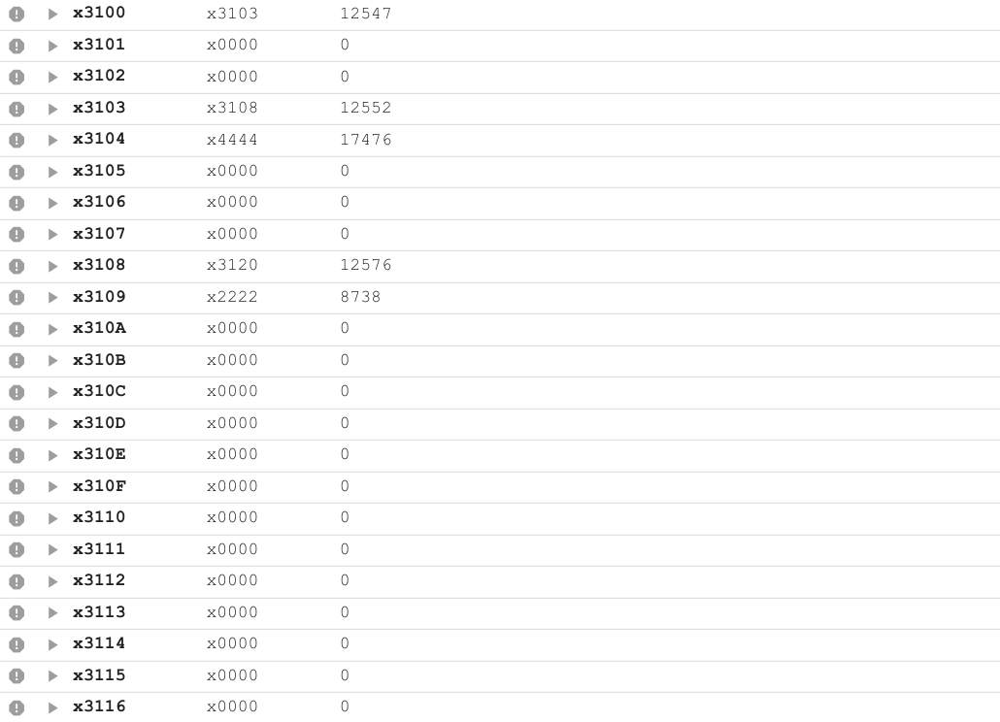
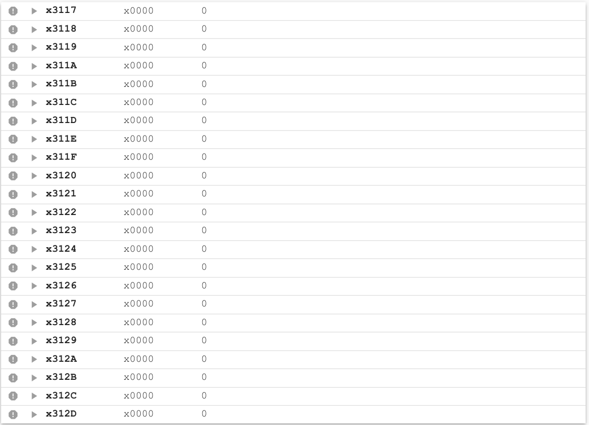
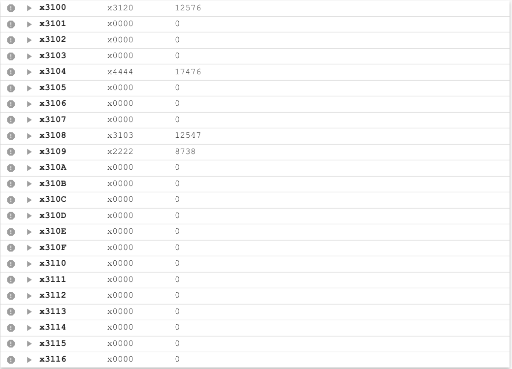
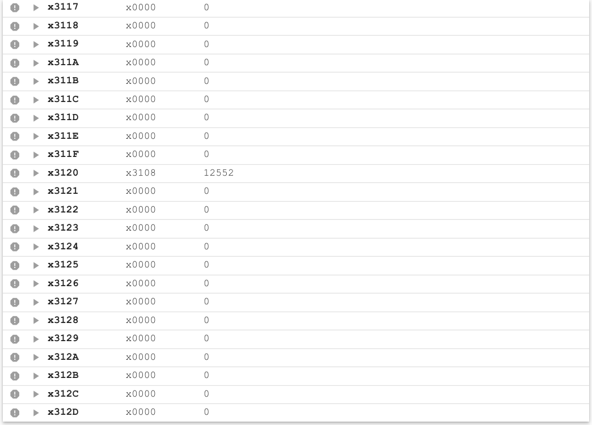
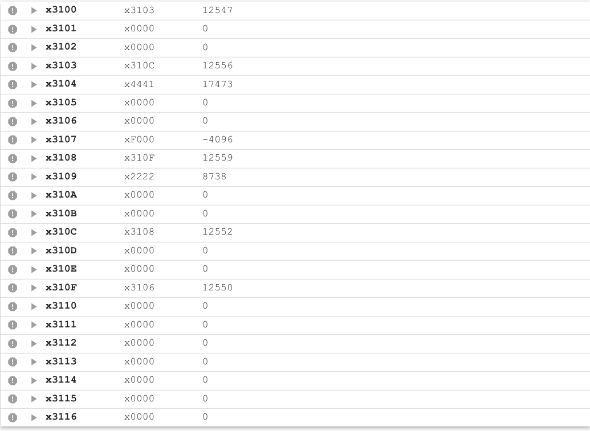
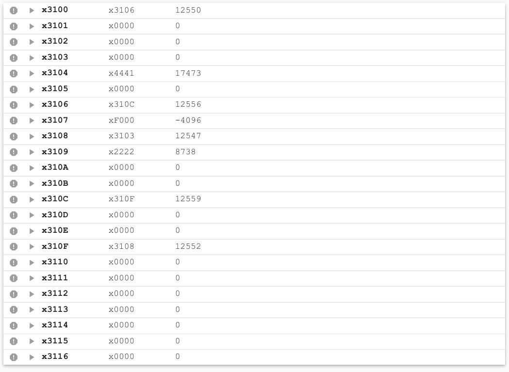
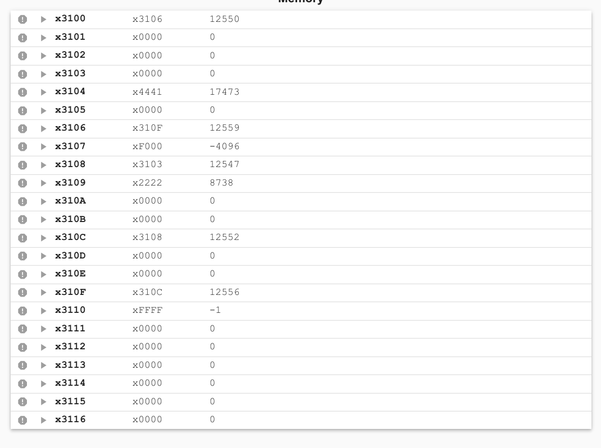

# 算法

*   感觉是选择排序，又有点像插入排序，即每次从head(head为头结点，没有实际意义，只是指示第一个节点所在的位置，当然这个head节点也有数据域，只是没有意义，任何值均可)之后找到最小的节点然后把它插入到head与head之后的节点之间。这个插入的操作是通过改变节点的指针域实现的，即改变节点之间的前后关系实现。最终结果是head的next(指针域)指向数据域最小的那个节点，然后next指向比该节点大的节点

# 实现

1.  首先写了c的伪代码

```c
    while (!head->next)     //  head会不断变化，不真正指向链表的头结点，但是一定是待排节点的头结点
    {
        p_pre = head;   //  p_pre为p的前面一个节点
        p = head->next;
        minp = p;   //  待排节点中最小节点的指针
        min = p->data;
        while (!p)
        {
            if (p->data < min)
            {
                min = p->data;
                minp = p;
                minp_pre = p_pre;   //  最小节点的前一个
            }
            p = p->next;
            p_pre = p_pre->next;
        }
        minp_pre->next = minp->next;    将最小节点移到最前面，通过指针的变换
        minp->next = head->next;
        head->next = minp;
        head = minp;        //  排除掉最小节点之后，对剩下的节点将要进行操作
    }
```

* 对每个节点分配两个空间，第一个是指针域，第二个是数据域

2.  分配寄存器
    1.  首先要得到所有节点的头结点HEAD，分配给R0。R0也作为将几个节点放到最前面之后剩下节点的头结点
    2.  R2:p_pre = head
    3.  R3:p = head->next
    4.  如果head->next==0说明没有待排节点，结束
    5.  否则R4:minp = p, R5:min = p->data, R1:minp_pre = p_pre
    6.  然后看R3(p)是否为NULL,如果是，则说明已经遍历了头结点之后的所有节点，找到了min,minp,minp_pre,可以进行交换，到DoneInner阶段进行插入，将
    7.  如果不为空，则和min进行比较。通过``p->data-min``的值来判断是否要给min,minp,minp_pre重新赋值。如果该值小于0，则重新赋值，否则跳转到EndIf段
    8.  EndIf段对p和p_pre分别赋值下一个位置，然后继续遍历，寻找最小值，所以跳回FindMin段重复
    9.  DoneInner段对找到的minp进行相应的指针变换。首先minp前面的节点(由minp_pre指向)，minp_pre->next = minp->next。然后minp->next = head->next。最后把minp接到head之后,head->next = minp。结束之后为了进行下一轮操作，需要让head往后，因此head = minp就是head = head->next


# 测试

1. x3100为头结点，x3100为指针域，指向第一个节点，三个待排节点





位置|指针|数据|
:--:|:--:|:--:|
x3100|x3103| |
x3103|x3108|x4444|
x3108|x3120|x2222|
x3120|x0000|x0000|

排序之后应该是

位置|指针|数据|
:--:|:--:|:--:|
x3100|x3120| |
x3103|x0000|x4444|
x3108|x3103|x2222|
x3120|x3108|x0000|

程序运行后(断点在HALT)





2.  x3100为头结点，加入负数，五个待排节点

输入



位置|指针|数据|
:--:|:--:|:--:|
x3100|x3103||
x3103|x310C|x4441(17473)|
x310C|x3108|x0000|
x3108|x310F|x2222(8738)|
x310F|x3106|x0000|
x3106|x0000|xF000(-4096)|

排序之后应该是
位置|指针|数据|
:--:|:--:|:--:|
x3100|x3106||
x3103|x0000|x4441(17473)|
x310C|x310F|x0000|
x3108|x3103|x2222(8738)|
x310F|x3108|x0000|
x3106|x310C|xF000(-4096)|

> 这里出现两个数据域为0000，根据排序算法应该是在原来的链表中位置靠前的节点还是排在前面，因为p->data-min == 0是不会更新min的，因此如果两个数据与相同的节点在原来的**链表**中的前后关系与在排序之后的**链表**中的前后位置关系不变。

结果



3. 将2的结果中的x310F的数据域x3110中的值改为-1

输入，上次的结果


排序之后应该是
位置|指针|数据|
:--:|:--:|:--:|
x3100|x3106||
x3103|x0000|x4441(17473)|
x310C|x3108|x0000|
x3108|x3103|x2222(8738)|
x310F|x310C|xFFFF(-1)|
x3106|x310F|xF000(-4096)|




