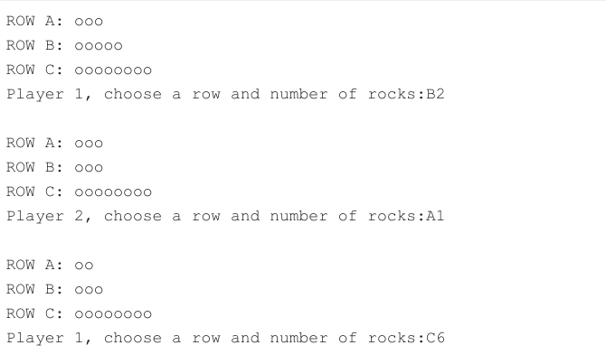
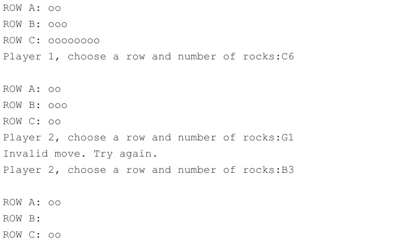
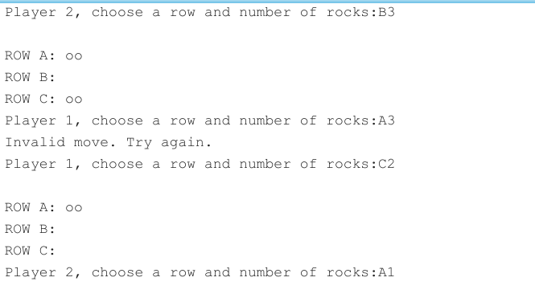
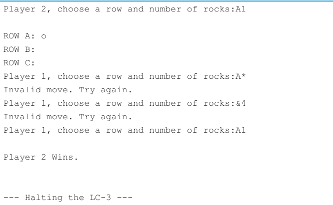

# 算法

*  按照题意，首先初始化rocks, 然后是输出行信息，接着输出Prompt信息，Prompt信息要根据当前的turn决定是Player1还是Player2。之后是输入部分，要先让两个字符输入，存到寄存器中，然后再判断，不能输入一个判断一个，否则不符合要求。对于输入的第一个字符，判断是否在A到C之间，然后是对第二个字符的判断，是否在0到9以及是否小于等于指定行的当前rocks数。这些条件要依次判断，一旦有不满足的，就输出Invalid信息，重新循环回到Prompt，重新执行，否则若依次都满足条件，那就在指定的行减去指定的数(通过内存中内容的减少来实现)。成功输入并在相应行减少指定数之后，改变turn，由一方换到另一方。在这之后，进行Check，如果检查到当前状态下所有行的rocks数量都是0，则获胜的一方是当前的turn所在，输出这个人，如果还是有行的rocks数量不为0，则重新回到OUTROW状态，输出当前的行状态，进行下一个turn

# 代码实现

1.  主体部分

```
        .ORIG x3000
INIITIAL        AND R0, R0, #0
        ADD R0, R0, #3
        ST  R0, NUMA
        ADD R0, R0, #2
        ST  R0, NUMB
        ADD R0, R0, #3
        ST  R0, NUMC
        AND R1, R1, #0  ;       R1 0 player1's turn, else player2's turn
GameLoop    JSR OUTROW
        JSR Input               ;   input will check the input and change the state
        JSR Check               ;   check will output the winner if game is over
        ADD R0, R0, #0          ;   R0   the symbols of gameover, R0=1 gameover
        BRz GameLoop
        HALT
NUMA    .BLKW   #1
NUMB    .BLKW   #1
NUMC    .BLKW   #1
```
>   这一段相当于main函数，首先是加载初始状态，然后是循环输出状态，输入，检查状态，知道游戏结束

2.  输出行部分

```
        .ORIG x3100
OUTROW  ST  R1, ROWR1
        ST  R7, ROWR7
        LEA  R1, ROWA
        JSR OUTSTRING
        LD  R1, NUMA
        JSR OUTROCK
        LEA  R1, ROWB
        JSR OUTSTRING
        LD  R1, NUMB
        JSR OUTROCK
        LEA  R1, ROWC
        JSR OUTSTRING
        LD  R1, NUMC
        JSR OUTROCK 
        LD  R7, ROWR7
        LD  R1, ROWR1
        RET

ROWR1   .BLKW   #1
ROWR7   .BLKW   #1
ROWA    .STRINGZ    "ROW A: "
ROWB    .STRINGZ    "ROW B: "
ROWC    .STRINGZ    "ROW C: "
        .END
```

>       这一段分别输出RowA，RowB，RowC的信息

3.      提示玩家游戏部分

```
;   Prompt Player (R1+1) to choose a row and number of rocks.
            .ORIG x3150
Prompt  ST R1, ProR1
        ST R7, ProR7
        ADD R1, R1, #0
        BRp Prompt2             ;   choose player2
        LEA R1, Player1Pro      ;   choose player1
        JSR OUTSTRING
        LD R7, ProR7
        LD R1, ProR1
        RET
Prompt2         LEA R1, Player2Pro
                JSR OUTSTRING
                LD R7, ProR7
                LD R1, ProR1
                RET
ProR1   .BLKW #1
ProR7   .BLKW #1
Player1Pro      .STRINGZ "Player 1, choose a row and number of rocks:"
Player2Pro      .STRINGZ "Player 2, choose a row and number of rocks:"
        .END

```

>       这里R1储存当前turn的玩家信息, R1 = 0输出玩家1开始，否则玩家2开始

4.      输出字符串部分，相当于PUTS函数(当时没有想到用，就重写了一个)

```
;   R1  the start address of the string to be output
            .ORIG x3220
OUTSTRING   ST R0, STRINGR0
            ST R1, STRINGR1
LOOP1       LDR R0, R1, #0
            BRz OUTDONE
            OUT
            ADD R1, R1, #1
            BRnzp LOOP1
OUTDONE     LD R0, STRINGR0
            LD R1, STRINGR1
            RET
STRINGR0  .BLKW   #1
STRINGR1  .BLKW   #1
            .END

```

5.      输出石头部分

```
;   R1  number of rocks to be output
            .ORIG x3300
OUTROCK     ST  R1, ROCKR1
            ST  R0, ROCKR0
            LD  R0, ROCK
            ADD R1, R1, #0
            BRz ROCKDONE
LOOP2       TRAP x21
            ADD R1, R1, #-1
            BRp LOOP2
ROCKDONE    LD  R0, NEWLINE
            TRAP x21
            LD  R1, ROCKR1
            LD  R0, ROCKR0
            RET
ROCKR1  .BLKW   #1
ROCKR0  .BLKW   #1
ROCK    .FILL       x006F
NEWLINE .FILL       x000A
        .END
```

>       这里会按照R1中的个数输出指定的石头数量

6.      输入部分，会让玩家开始输入，检查输入是否有效，并根据有效输入进行相应操作，无效输入则循环

```
;       Input include Prompt. It will change R1, the turn. It will also check whether the input is valid
                .ORIG x3020
Input           ST R1, InputR1
                ST R2, InputR2
                ST R3, InputR3
                ST R6, InputR6
                ST R7, InputR7
InputLoop       JSR Prompt
                GETC
                OUT
                ADD R4, R0, #0
                GETC
                OUT
                ADD R5, R0, #0
                LD R0, NEWLINE1
                OUT
                LD R2, ASCIIC
                NOT R2, R2
                ADD R2, R2, #1
                ADD R3, R4, R2
                BRp InValid
                LD R2, ASCIIA
                NOT R2, R2
                ADD R2, R2, #1
                ADD R3, R4, R2
                BRn InValid
                ADD R4, R3, #0  ;       R4, row-1
                LD R2, ASCII9
                NOT R2, R2
                ADD R2, R2, #1
                ADD R3, R5, R2
                BRp InValid
                LD R2, ASCII1
                NOT R2, R2
                ADD R2, R2, #1
                ADD R3, R5, R2
                BRn InValid
                ADD R5, R3, #1  ;       R5, Number
                ADD R6, R4, #0
                BRp Two
                LD R2, NUMA
                NOT R3, R5
                ADD R3, R3, #1
                ADD R3, R2, R3  ;       NUMA-Number
                BRn InValid
                ST R3, NUMA
                BRnzp InputDone
Two             ADD R6, R4, #-1
                BRp Three
                LD R2, NUMB
                NOT R3, R5
                ADD R3, R3, #1
                ADD R3, R2, R3  ;       NUMB-Number
                BRn InValid
                ST R3, NUMB
                BRnzp InputDone
Three           LD R2, NUMC
                NOT R3, R5
                ADD R3, R3, #1
                ADD R3, R2, R3  ;       NUMC-Number
                BRn InValid
                ST R3, NUMC
                BRnzp InputDone
InValid         LEA R1, InValidStr
                JSR OUTSTRING
                OUT
                LD R1, InputR1
                BRnzp InputLoop
InputDone       OUT
                LD R7, InputR7
                LD R1, InputR1
                LD R2, InputR2
                LD R3, InputR3
                LD R6, InputR6
                ADD R1, R1, #0
                BRz Set1
                AND R1, R1, #0
                RET
Set1            ADD R1, R1, #1
                RET
InputR1         .BLKW   #1
InputR2         .BLKW   #1
InputR3         .BLKW   #1
InputR6         .BLKW   #1
InputR7         .BLKW   #1
ASCII1          .FILL   x0031
ASCII9          .FILL   x0039
ASCIIA          .FILL   x0041
ASCIIC          .FILL   x0043
NEWLINE1        .FILL   x000A
InValidStr      .STRINGZ        "Invalid move. Try again."
                .END
```
>       这里会在读完两个输入(读的同时输出)的字符之后再开始进行判断是否符合要求，同时会打印一个换行，如果说无效，这输出无效提示字符串然后再返回Prompt，否则就在相应的行减去指定的数量

7.      检查部分会检查所有行是否都为空，若都为空，会根据当前的turn输出赢家，因为在Input的时候就已经把turn交给下一个赢家了，同时还会将R0置为1作为返回值，表示结束游戏

```
Check           ST R2, CHECKR2
                ST R7, CHECKR7
                LD R2, NUMA
                BRp Continue
                LD R2, NUMB
                BRp Continue
                LD R2, NUMC
                BRz Win
Continue        LD R2, CHECKR2
                LD R7, CHECKR7
                AND R0, R0, #0
                RET
Win             ADD R1, R1, #0
                BRz P1
                LEA R1, P2Win
                JSR OUTSTRING
                LD R0, NEWLINE1
                LD R7, CHECKR7
                OUT
                AND R0, R0, #0
                ADD R0, R0, #1
                RET
P1              LEA R1, P1Win
                JSR OUTSTRING
                LD R0, NEWLINE1
                LD R7, CHECKR7
                OUT
                AND R0, R0, #0
                ADD R0, R0, #1
                RET
CHECKR2         .BLKW   #1
CHECKR7         .BLKW   #1
P1Win           .STRINGZ        "Player 1 Wins."
P2Win           .STRINGZ        "Player 2 Wins."
                .END

```

# 测试数据

* 网页上给的例子已经比较全面了，包括行的错误输入，数字的错误输入，数字大于当前行内的rocks数量等










