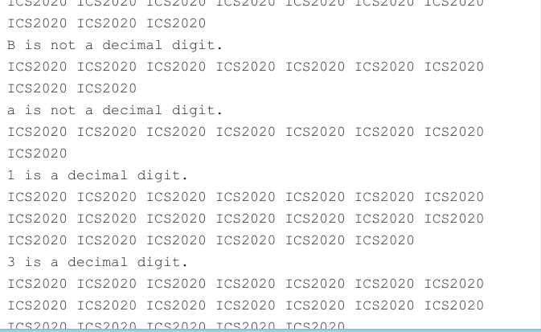

# 算法

一旦keyboard有输入，就要跳转到中断程序x1000进行执行，这个操作主要是通过系统产生的中断，即在x0180位置的键盘产生的中断信号来跳转

用户程序就是输出，延迟，输出，延迟

x1000的中断之后的处理程序就是根据键盘的输入，判断范围，然后输出相应的回复，最后RTI返回用户程序

# 实现

在系统程序中

```
        .ORIG x800
        ; (1) Initialize interrupt vector table.
        LD R0, VEC
        LD R1, ISR
        STR R1, R0, #0

        ; (2) Set bit 14 of KBSR.
        LDI R0, KBSR
        LD R1, MASK
        NOT R1, R1
        AND R0, R0, R1
        NOT R1, R1
        ADD R0, R0, R1
        STI R0, KBSR

        ; (3) Set up system stack to enter user space.
        LD R0, PSR
        ADD R6, R6, #-1
        STR R0, R6, #0
        LD R0, PC
        ADD R6, R6, #-1
        STR R0, R6, #0
        ; Enter user space.
        RTI
VEC     .FILL x0180
ISR     .FILL x1000
KBSR    .FILL xFE00
MASK    .FILL x4000
PSR     .FILL x8002
PC      .FILL x3000
        .END
```

第一步主要是在``x180``位置放上``x1000``的中断处理程序

第二步是将KBSR的bit[14]置为1，这样只要bit[15]ready就进入中断处理程序

第三步是将用户程序``x3000``写入系统栈中，保存用户程序的起始位置和PSR来表明该用户程序的特权级，优先级和条件码


接着是用户程序

```
        .ORIG x3000
        ; *** Begin user program code here ***
        LEA R0, ICS
LOOP    PUTS
        JSR DELAY
        BRnzp LOOP

DELAY   ST R1, SaveR1
        LD R1, COUNT
REP     ADD R1, R1, #-1
        BRp REP
        LD R1, SaveR1
        RET
COUNT   .FILL   x7FFF
SaveR1  .BLKW   #1
```

通过PUTS来打印字符串

然后延迟一段时间，再打印，再延迟，在打印，不会结束

这里延迟count设为$2^{15}-1$


然后是中断处理程序

```
        .ORIG x1000
        ; *** Begin interrupt service routine code here ***
        ST R0, SaveR0
        ST R2, SaveR2
        GETC
        LD R2, Zero
        NOT R2, R2
        ADD R2, R2, #1
        ADD R2, R0, R2
        BRn Invalid
        LD R2, Nine
        NOT R2, R2
        ADD R2, R2, #1
        ADD R2, R0, R2
        BRp Invalid
        ADD R2, R0, #0
        LD R0, NewLine
        OUT
        ADD R0, R2, #0
        OUT
        LEA R0, IsString
        PUTS
        LD R0, NewLine
        OUT
        LD R0, SaveR0
        LD R2, SaveR2
        RTI
Invalid ADD R2, R0, #0
        LD R0, NewLine
        OUT
        ADD R0, R2, #0
        OUT
        LEA R0, NotString
        PUTS
        LD R0, NewLine
        OUT
        LD R0, SaveR0
        LD R2, SaveR2
        RTI
SaveR0  .BLKW   #1
SaveR2  .BLKW   #1
Zero    .FILL   x0030
Nine    .FILL   x0039
NewLine .FILL   x000A
IsString        .STRINGZ        " is a decimal digit."
NotString       .STRINGZ        " is not a decimal digit."
```

首先是将R0，R2保存，因为这个程序会用到R0，R2

然后是读入到R0并OUT输出，接着R2分别加载0，9来进行判断范围，一旦超出，就跳转到Invalid部分输出 is not a decimal digit，都没有超出才输出is a decimal digit，在这两个分支下都要重新加载R0，R2，然后在RTI返回用户程序


#	测试





主要测试端点0，9和一些其他数