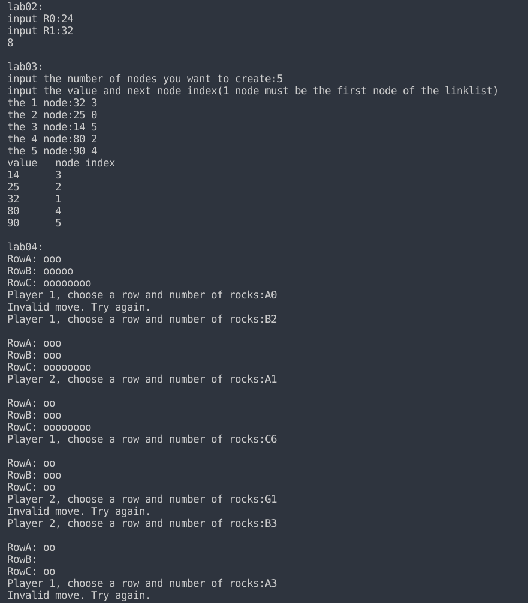
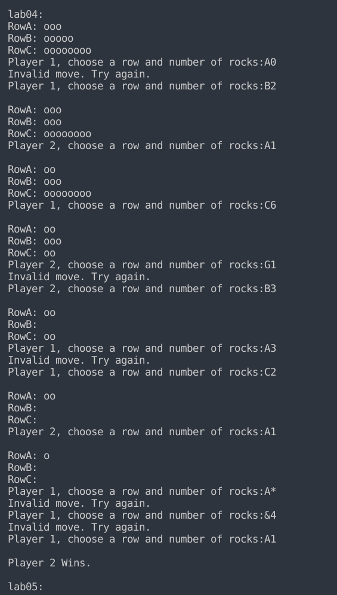
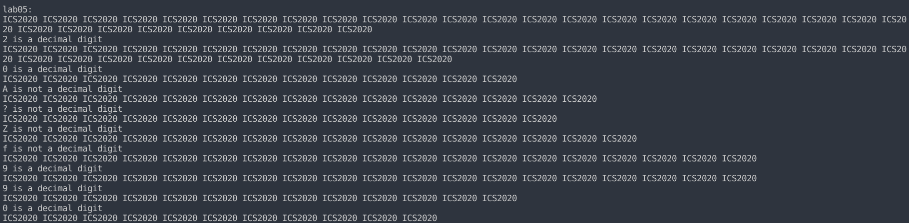

所有实验的测试结果统一在最后

### lab02

#### 算法

辗转相减法

#### 实现

R0, R1通过输入得到值(假定输入是正整数)

R2是相减结果，不断将|R2|的值赋给被减数R0，R1值中较小的那个，这里判断大小也是通过R2的正负来判断

不断循环直到R1 == R0 (R0 == 0)

```c
void lab02()
{
    int R0, R1, R2;
    printf("input R0:");
    scanf("%d", &R0);
    printf("input R1:");
    scanf("%d", &R1);
    do
    {
        R2 = R0 - R1;
        if (R2 > 0)
            R0 = R2;
        else
            R1 = -R2;
    } while (R2 != 0);  //  R2 == 0为辗转相减法算法的结束
    printf("%d\n", R0);
}
```

### lab03

#### 算法

插入排序，找到最小的节点，然后改变{该节点之前的节点，该节点，head节点}的指针域，将其插入head之后(head会在每次插入之后移到下一个节点)。

#### 实现

```c
typedef struct LNode
{
    int i;
    struct LNode *next;
    int value;
} LNode, *LinkList;
```

> ​	i代表在输入时是第几个节点
>
> ​	next是指针域
>
> ​	value是数值域

```c
    int num = 0;
    printf("input the number of nodes you want to create:");
    scanf("%d", &num);
    LinkList *List;
    List = (LinkList *)malloc((num+1) * sizeof(LinkList));
    for (int i = 0; i <= num; i++)
    {
        List[i] = (LinkList)malloc(sizeof(*List[i]));
    }
    List[0] = NULL;
    printf("input the value and next node index(1 node must be the first node of the linklist)\n");
    for (int i = 1; i <= num; i++)
    {
        printf("the %d node:", i);
        int next = 0;
        scanf("%x%d", &List[i]->value, &next);
        getchar();
        List[i]->next = List[next];
        List[i]->i = i;
    }
```

上面这部分是输入部分

List是节点指针数组，但是节点之间是通过next来连接的，而不是通过顺序存储的关系来连接

通过输入，来指定相应节点的前后关系，

先输入value，再输入next节点的下标

最后一个节点的next域指向NULL，输入的时候输入0即可


```c
    LinkList HEAD = (LinkList)malloc(sizeof(*HEAD));
    HEAD->next = List[1];
    LinkList head = HEAD;
    LinkList p, p_pre, minp, minp_pre;
    int min;
    while (head->next)
    {
        p_pre = head;
        p = head->next;
        minp = p;
        minp_pre = p_pre;
        min = p->value;
        while (p)
        {
            if (p->value < min)
            {
                min = p->value;
                minp = p;
                minp_pre = p_pre;
            }
            p = p->next;
            p_pre = p_pre->next;
        }
        minp_pre->next = minp->next;
        minp->next = head->next;
        head->next = minp;
        head = minp;
    }

    printf("value\tnode index\n");
    p = HEAD->next;
    while (p)
    {
        printf("%x\t%d\n", p->value, p->i);
        p = p->next;
    }
```

> ​	HEAD为真实头节点
>
> ​	head为假的头结点，会在循环中改变
>
> ​	minp指向最小值的节点，minp_pre指向minp前面的那个节点，min为minp->value
>
> ​	在找到最小节点之后，进行相应的指针域变换，然后head=head->next,进行下一轮操作
>
> ​	最后是输出，分别是节点的值和节点在输入时的序号

### lab04

#### 算法

首先初始化，然后输出行信息，接着到输入部分，根据turn输出Prompt让相应玩家输入，然后输入两个字符，进行检查，检查符合条件，则将turn修改，跳出Input部分，到check部分，否则还要重新Prompt，再循环一遍。到Check部分检查当前的行的情况，如果都为0，则当前turn所在玩家就是赢家，输出胜利信息，还要返回true来停止循环，否则重新回到输出行信息的部分，再一次循环

#### 实现

主函数

```c
void lab04()
{
    int turn = 0;
    int checkresult = 0;
    int rocksA = 3, rocksB = 5, rocksC = 8;
    while (!checkresult)
    {
        OutRow(rocksA, rocksB, rocksC);
        Input(&rocksA, &rocksB, &rocksC, &turn);
        checkresult =  Check(rocksA, rocksB, rocksC, turn);
    }
    return ;
}

```

> ​	turn表示玩家信息，0表示玩家1这一轮，1表示玩家2这一轮
>
> ​	checkresult用来接受Check函数返回的信息
>
> ​	rocks?分别是A,B,C行的石头个数
>
> ​	初始化完成之后，进行游戏循环，首先输出行信息，然后是输入部分，接着是检查部分，如果检查到游戏结束，则退出循环

OutRow

```c
void OutRow(int rocksA, int rocksB, int rocksC)
{
    printf("RowA: ");
    for (int i = 0; i < rocksA; i++)
    {
        putchar('o');
    }
    putchar('\n');
    printf("RowB: ");
    for (int i = 0; i < rocksB; i++)
    {
        putchar('o');
    }
    putchar('\n');
    printf("RowC: ");
    for (int i = 0; i < rocksC; i++)
    {
        putchar('o');
    }
    putchar('\n');
    return ;
}

```

> ​	根据rocksA，rocksB, rocksC输出行信息

Prompt

```c
void Prompt(int turn)
{
    if (turn)
    {
        printf("Player 2, choose a row and number of rocks:");
    }
    else
    {
        printf("Player 1, choose a row and number of rocks:");
    }
}

```

> ​	turn为0，输出Player1的Prompt， 否则输出玩家2的

Input

```c
void Input(int *rocksA, int *rocksB, int *rocksC, int *turn)
{
    int Invalidflag = 1;
    char row, number;
    while (Invalidflag)
    {
        Invalidflag = 0;
        Prompt(*turn);
        row = getchar();
        number = getchar();
        getchar();
        number = number-'0';
        if (row < 'A' || row > 'C')
        {
            Invalidflag = 1;
        }
        if (row == 'A')
        {
            if (number > 0 && number <= *rocksA)
                *rocksA -= number;
            else
                Invalidflag = 1;
        }
        else if (row == 'B')
        {
            if (number > 0 && number <= *rocksB)
                *rocksB -= number;
            else
                Invalidflag = 1;
        }
        else if (row == 'C')
        {
            if (number > 0 && number <= *rocksC)
                *rocksC -= number;
            else
                Invalidflag = 1;
        }
        if (Invalidflag)
        {
            printf("Invalid move. Try again.");
        }
        putchar('\n');
    }
    *turn = 1-*turn;

}

```

> ​	首先要Prompt，然后是读取两个字符，第三个getchar读取换行
>
> ​	然后是判断，有效则更改rocks信息，更改turn，无效则循环

Check

```c
int Check(int rocksA, int rocksB, int rocksC, int turn)
{
    if (rocksA == 0 && rocksB == 0 && rocksC == 0)
    {
        if (turn == 0)
            printf("Player 1 Wins.\n");
        else
            printf("Player 2 Wins.\n");
        return 1;
    }
    return 0;
}

```

> ​	根据rocks判断游戏是否结束，根据turn判断谁赢，turn == 0，P1赢，否则P2赢

### lab05

#### 算法

通过在while循环之后加上检测键盘输入，来实现中断处理

#### 实现

```c
void lab05()
{
    char ch;
    while (1)
    {
        system("stty -echo");
        while (!kbhit())
        {
            printf("ICS2020 ");
            fflush(stdout);
            if (kbhit())
                break;
            delay();
        }
        putchar('\n');
        ch = getchar();
        if (ch <= '9' && ch >= '0')
            printf("%c is a decimal digit\n", ch);
        else
            printf("%c is not a decimal digit\n", ch);
    }
}

```

> ​	``system("stty -echo")``是让``getchar()``的时候不回显，这是在linux操作系统下的解决方案，在windows操作系统下的``conio.h``库下有``getch()``函数可以解决回显的问题
>
> ​	``fflush(stdout)``可以让``printf()``的输出立刻显示，因为``printf``的输出是要在'\n'的情况下才会马上输出
>
> ​	``delay()``函数可以延迟一段时间

kbhit(keyboard hit)

```c
int kbhit()
{
    struct termios oldt, newt;
    int oldf;
    int ch;

    tcgetattr(STDIN_FILENO, &oldt);
    newt = oldt;
    newt.c_lflag &= ~(ICANON | ECHO);
    tcsetattr(STDIN_FILENO, TCSANOW, &newt);
    oldf = fcntl(STDIN_FILENO, F_GETFL, 0);
    fcntl(STDIN_FILENO, F_SETFL, oldf | O_NONBLOCK);
    ch = getchar();
    tcsetattr(STDIN_FILENO, TCSANOW, &oldt);
    fcntl(STDIN_FILENO, F_SETFL, oldf);

    if (ch != EOF)
    {
        ungetc(ch, stdin);
        return 1;
    }

    return 0;
}
```

> 这里是涉及到操作系统的代码

delay

```c
void delay(void)
{
    int count = 100000000;
    while (count != 0)
    {
        --count;
    }
    return;
}
```

> ​	延迟一段时间

### 测试




* lab2的两个输入为正整数，输出为最大公因数
* lab3要求输入节点个数，value值和next域指向节点的下标，虽然输入是顺序表形式，但是排序算法还是链表的排序。输入用顺序的形式只是为了输入方便而且比较简单易懂。另外最后一个节点的next域输入为0，在程序中会将next域设为NULL




* lab4即按照样例进行测试，多加了一点就是A0的输入被视为无效




* lab5的实现